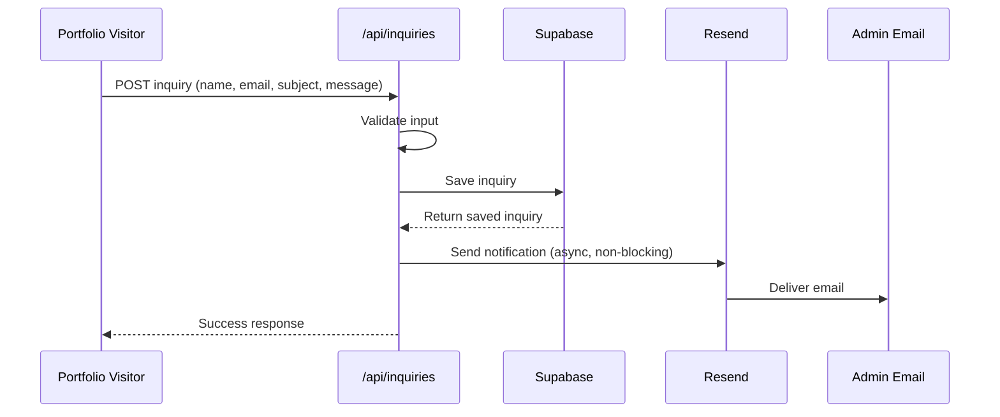

# Email Notification Implementation Summary

## ✅ What Was Implemented

Email notifications are now automatically sent to the admin when new inquiries are submitted through the portfolio contact form.

## 📦 Changes Made

### 1. New Dependencies
- **resend** - Modern email API service for sending notifications

### 2. New Files Created

| File | Purpose |
|------|---------|
| `src/lib/email.ts` | Email utility functions with HTML/text templates |
| `docs/EMAIL-NOTIFICATIONS.md` | Complete setup and troubleshooting guide |
| `scripts/test-email.js` | Test script to verify email functionality |
| `.env.example` | Example environment configuration file |

### 3. Modified Files

| File | Changes |
|------|---------|
| `src/app/api/inquiries/route.ts` | Added POST endpoint with email notification trigger |
| `README.md` | Added email notification feature and environment variables |
| `.github/copilot-instructions.md` | Added email notification patterns and references |
| `DEPLOYMENT.md` | Added email configuration requirements |

## 🚀 Quick Start

### 1. Install Dependencies
```bash
npm install
```

### 2. Get Resend API Key
1. Sign up at [resend.com](https://resend.com)
2. Create an API key
3. (Optional) Verify your domain for production use

### 3. Configure Environment Variables
Add to your `.env.local`:

```bash
RESEND_API_KEY=re_xxxxxxxxxxxxxxxxxxxxxxxxxxxxx
RESEND_FROM_EMAIL=notifications@sachinthya.dev
ADMIN_EMAIL=admin@sachinthya.dev
NEXT_PUBLIC_APP_URL=http://localhost:3000
```

### 4. Test Locally
```bash
# Start dev server
npm run dev

# In another terminal, run test
node scripts/test-email.js
```

### 5. Deploy to Production
Add the same environment variables in your Vercel dashboard:
- Go to Settings → Environment Variables
- Add all email-related variables
- Redeploy

## 📧 How It Works



**Key Features:**
- ✅ **Non-blocking**: Email sent asynchronously, doesn't slow down API
- ✅ **Fail-safe**: Inquiry saved even if email fails
- ✅ **Professional**: Beautiful HTML template with branding
- ✅ **Accessible**: Plain text fallback for all email clients
- ✅ **Secure**: Input sanitization prevents XSS attacks

## 🎨 Email Template Features

The notification email includes:

- **Gradient header** matching admin panel theme
- **All inquiry details**: Name, email, subject, message
- **Timestamp** of submission
- **Direct link** to view in dashboard
- **Responsive design** for mobile and desktop
- **Plain text version** for compatibility

## 🧪 Testing

### Manual Test (API)
```bash
curl -X POST http://localhost:3000/api/inquiries \
  -H "Content-Type: application/json" \
  -d '{
    "name": "Test User",
    "email": "test@example.com",
    "subject": "Test Subject",
    "message": "Test message"
  }'
```

### Automated Test Script
```bash
node scripts/test-email.js
# Or for production:
node scripts/test-email.js https://your-app.vercel.app
```

## 🔧 Environment Variables

| Variable | Required | Default | Description |
|----------|----------|---------|-------------|
| `RESEND_API_KEY` | ✅ Yes | - | Your Resend API key |
| `RESEND_FROM_EMAIL` | ⚠️ Recommended | `notifications@sachinthya.dev` | Sender email address |
| `ADMIN_EMAIL` | ⚠️ Recommended | `admin@sachinthya.dev` | Where notifications are sent |
| `NEXT_PUBLIC_APP_URL` | ❌ Optional | `https://admin.sachinthya.dev` | Admin panel URL for links |

## 📊 Monitoring

### Check Email Delivery
1. **Resend Dashboard** → Activity
   - See all sent emails
   - Check delivery status
   - View any errors

2. **Vercel Logs** → Functions
   - Filter for `/api/inquiries`
   - Look for email confirmations
   - Debug any issues

## 🚨 Troubleshooting

### Email Not Received?

1. **Check Resend Activity**: See if email was sent
2. **Check spam folder**: May be filtered
3. **Verify domain**: Custom domains must be verified
4. **Check logs**: Look for error messages
5. **Verify API key**: Must be valid and active

### Common Issues

**Issue**: Rate limit exceeded
- **Solution**: Free tier allows 100 emails/day. Upgrade plan or verify domain.

**Issue**: Email from `onboarding@resend.dev`
- **Solution**: Verify your custom domain in Resend dashboard.

**Issue**: "Invalid API key"
- **Solution**: Ensure `RESEND_API_KEY` is set and starts with `re_`.

## 📚 Documentation

For detailed setup instructions, see:
- **Setup Guide**: [docs/EMAIL-NOTIFICATIONS.md](../docs/EMAIL-NOTIFICATIONS.md)
- **API Documentation**: [README.md](../README.md#-api-endpoints)
- **Deployment**: [DEPLOYMENT.md](../DEPLOYMENT.md)

## 🎯 Next Steps

1. **Test email locally** using the test script
2. **Configure Resend account** and get API key
3. **Verify custom domain** (for production)
4. **Set environment variables** in Vercel
5. **Deploy and test** in production

## 💡 Best Practices

- **Different emails for dev/prod**: Use separate `ADMIN_EMAIL` for each environment
- **Monitor quota**: Check Resend dashboard to avoid hitting limits
- **Enable DMARC**: Improves deliverability and security
- **Test before launch**: Verify emails arrive in inbox, not spam
- **Customize template**: Edit `src/lib/email.ts` to match your brand

## 🔐 Security

- ✅ HTML escaping prevents XSS
- ✅ Email format validation
- ✅ Input sanitization (trim, normalize)
- ✅ Non-blocking sends (errors don't expose details)
- ✅ Rate limiting (via Resend)

## ✨ Features

- Professional email template
- HTML + plain text versions
- Mobile-responsive design
- Direct dashboard links
- Non-blocking delivery
- Error logging
- Input validation
- XSS protection

---

**Implementation Date**: January 9, 2026
**Status**: ✅ Complete and Ready for Production
